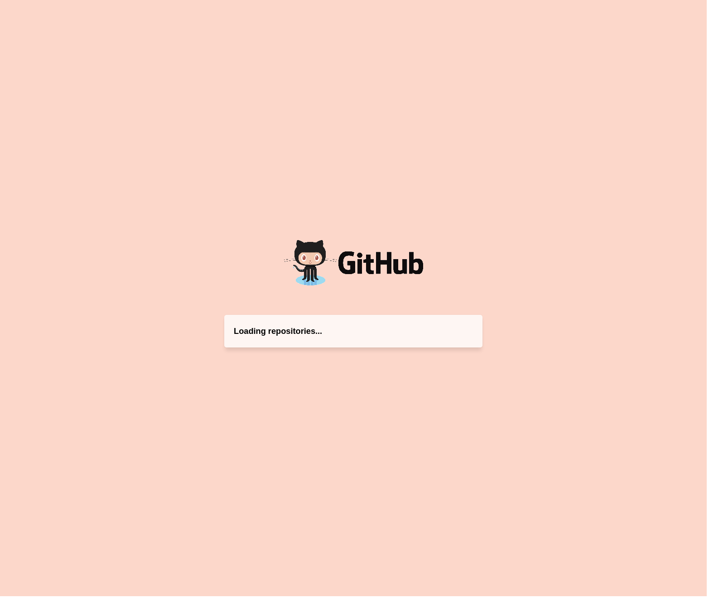
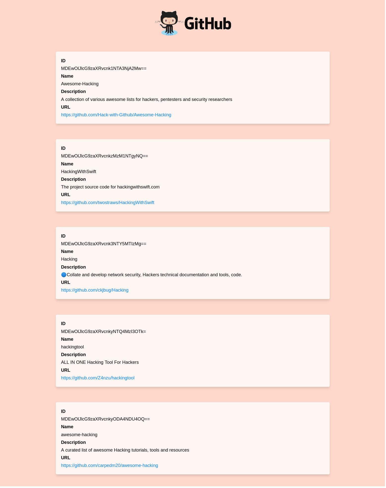

# React apollo graphql experiments

<table>
    <tr>
        <td>This project serves as example to consume the Graphql API from Github using the apollo client.</td>
    </tr>
</table>

## Demo





##  Usage

1. <b>Clone</b> the repo.
```sh
git clone https://github.com/sudo-von/react-apollo-graphql-experiments.git
```

2. <b>Install</b> npm dependencies.
```sh
npm install
```

3. <b>Rename</b> the .env.sample to .env and set your github token.
If you don't know how to generate your token you can follow the next link:
https://github.blog/2013-05-16-personal-api-tokens/

4. <b>Start</b> the project.
```sh
npm start
```